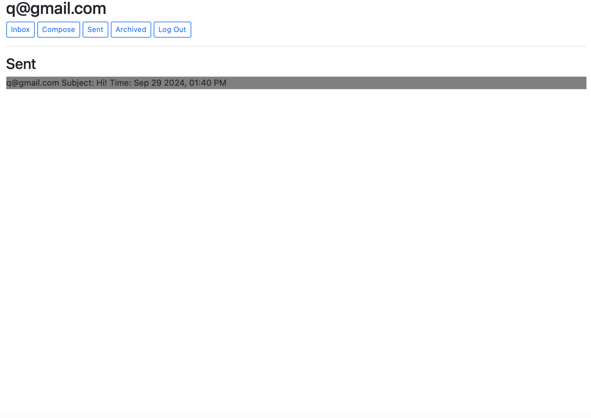
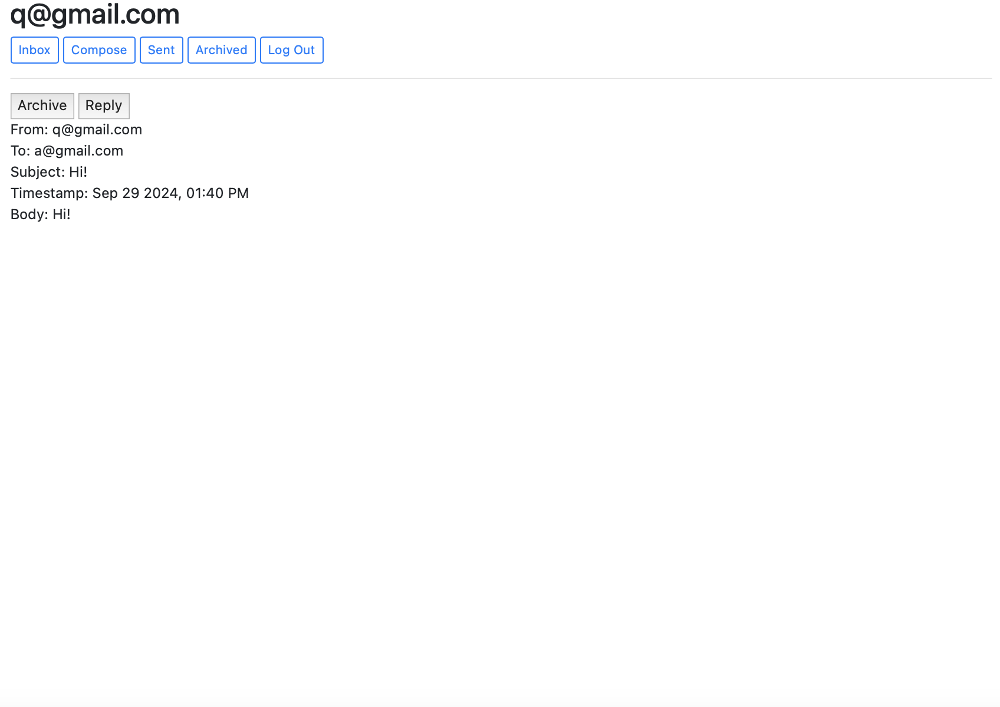
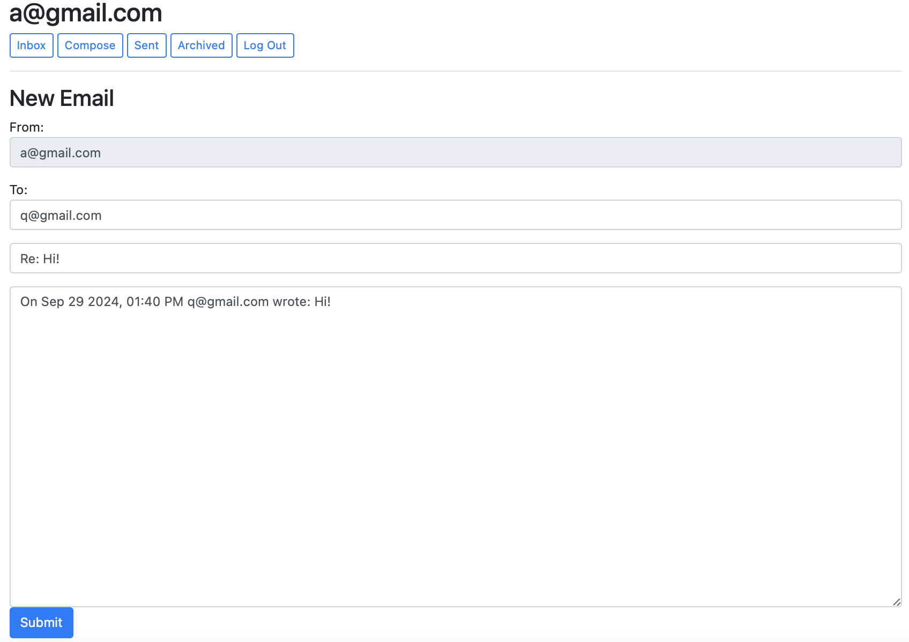
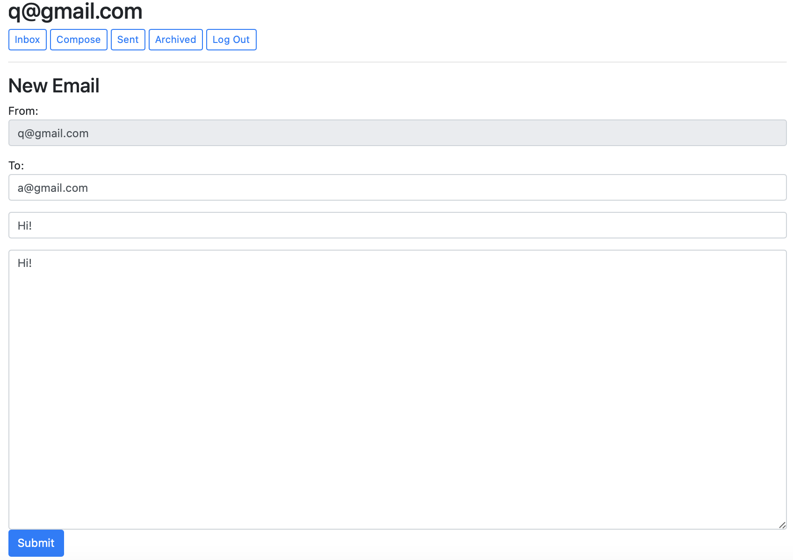

# Email_Clone

This project is a simplified email servive built with Django on the backend and JS on the frontend. It allows users to register, log in, send and receive emails, archive messages, and mark them as read or unread. Also integrated the use of API endpoints.

**Features**
1. User Authentication: Users can register, log in, and log out.
2. Inbox: View all received emails, mark them as read/unread.
3. Sent Mail: View all sent emails.
4. Archiving: Archive or unarchive emails.
5. Compose Emails: Send new emails to registered users.
6. Reply to Emails: Reply to received emails.
7. Pagination: Paginate emails for better user experience.

**Technologies Used**
1. Backend: Django 
2. Frontend: HTML, CSS, JavaScript
3. Database: SQLite 

**Installation**

Clone the repository:
git clone https://github.com/your-username/email-app.git
cd email-app

Install dependencies:
Ensure you have Python 3 and pip installed. Run:
pip install -r requirements.txt

Run migrations:
python manage.py migrate

Start the Django server:
python manage.py runserver

**Usage**

Login/Register:
New users can register via the register form.
Registered users can log in using their email and password.

Compose an Email:
Click on the "Compose" button to create a new email.
Enter recipient emails (comma-separated), subject, and body, and click "Send".

View Mailbox:
Use the navigation buttons to switch between Inbox, Sent, and Archived views.

View/Archive Emails:
Click on any email to view its content.
Archive or unarchive emails using the provided button.

Reply:
Click the "Reply" button when viewing an email to respond.

**API Endpoints**
This app provides several API endpoints that can be accessed by the frontend:
1. POST /emails: Send a new email.
2. GET /emails/<mailbox>: Retrieve emails for a specific mailbox (inbox, sent, archive).
3. GET /emails/<email_id>: Get the details of a specific email.
4. PUT /emails/<email_id>: Update email status (mark as read or archive/unarchive).

**View of Website**

Main

Email view

Reply view

Compose view

